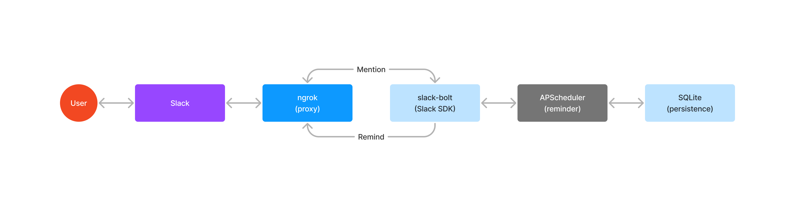

# hisho

- うゆぷんの雑用を一手に引き受けてくれるDA出身の秘書、井ノ上たきなさんです


### 環境構築

- 事前に [rye](https://rye-up.com/) のインストールが必要
- 事前に [ngrok](https://ngrok.com/download) のインストールと [ngrok](https://dashboard.ngrok.com/signup) の登録が必要

```bash
# 事前に https://api.slack.com/apps/A05QQL8BRJ8 からBot User OAuth TokenとSigning Secretの設定が必要
$ cp .env.example .env
$ touch database.sqlite
$ rye sync
$ rye run dev
# 事前に https://dashboard.ngrok.com/login からログインし、 authtoken を取得
$ ngrok config add-authtoken <your authtoken>
$ ngrok http 3000
```

- [Event Subscriptions](https://api.slack.com/apps/A05QQL8BRJ8/event-subscriptions) を開く
- 上記でngrokから発行されたURLの末尾に `/slack/events` を付加した `https://XXXX-XXXX-XXX-XXX-XXXX-XXXX-XXXX-XXXX-XXXX.ngrok-free.app/slack/events` を `Enable Events` に設定し、チャレンジする
- チャレンジに成功したら、 `Subscribe to bot events` に `app_mention` を追加する

### リンク

- [Slack API](https://api.slack.com/apps/A05QQL8BRJ8)

### アーキテクチャ


